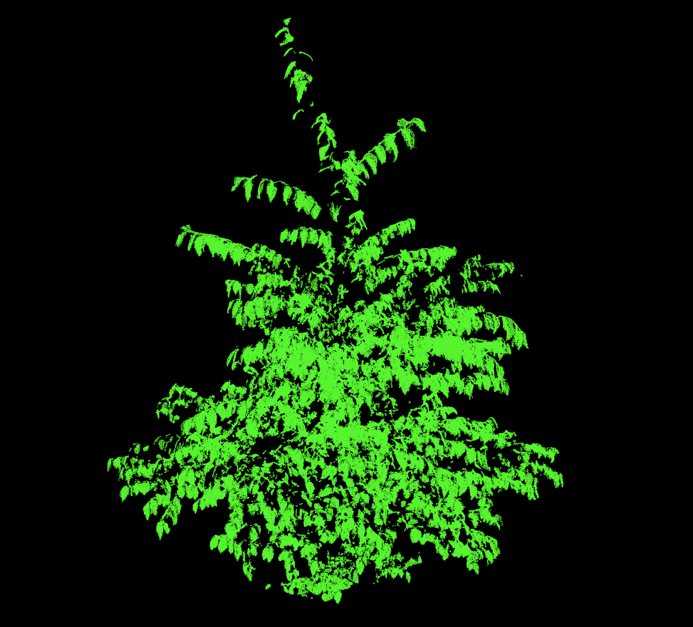

<a name="readme-top"></a>

<div align="left">
  
  <br/>
</div>

<!-- TABLE OF CONTENTS -->

# 📗 Table of Contents

- [📖 About the Project](#about-project)
  - [🛠 Built With](#built-with)
    - [Key Features](#key-features)
- [💻 Getting Started](#getting-started)
  - [Setup](#setup)
  - [Prerequisites](#prerequisites)
  - [Usage](#usage)
- [👥 Authors](#authors)
- [📝 License](#license)

<!-- PROJECT DESCRIPTION -->

# 📖 Leaf-Angle-Distribution <a name="about-project"></a>

This repository contains algorithms aimed at automating processes of obtaining leaf angle distribution information from Terrestrial Laser Scanning (TLS) datasets.

## 🛠 Built With <a name="built-with"></a>

- Python

### Key Features <a name="key-features"></a>

- **merge_files.py - Merges all point clouds (e.g., .txt or .xyz e.t.c.) in a directory into one point cloud**
- **normals_to_angles.py - Calculates the angle between a surface's normal and the z-axis**

<p align="right">(<a href="#readme-top">back to top</a>)</p>

## 💻 Getting Started <a name="getting-started"></a>

To get a local copy up and running, follow these steps.

### Prerequisites

In order to run the files in this project you need a text editor or an IDE such as VS code, sublime, atom e.t.c and have Python 3 installed.

### Setup

Clone this repository to your desired folder:

Example commands:

```sh
 $ cd my-folder
 $ git clone git@github.com:mutugi-c/Leaf-Angle-Distribution.git
```

### Usage

To use the python files, provide paths to your data and run the codes using the text editor or IDE.

<p align="right">(<a href="#readme-top">back to top</a>)</p>

<!-- AUTHORS -->

## 👥 Authors <a name="authors"></a>

👤 **Chris Mutugi**

- GitHub: [@mutugi-c](https://github.com/mutugi-c)
- Twitter: [@chris\_\_mutugi](https://twitter.com/chris__mutugi)
- LinkedIn: [chris-mutugi](https://www.linkedin.com/in/chris-mutugi-46594b123/)

<!-- FUTURE FEATURES -->

## 🔭 Future Features <a name="future-features"></a>

- **An algorithm to calculate the inclination probability density function (pdf)**

<p align="right">(<a href="#readme-top">back to top</a>)</p>
